# Introduzione
Progetto per il corso di "Metodi Avanzati di Programmazione" A.A. 2022-2023 Università degli Studi di Bari Aldo Moro

Progettare e realizzare un sistema clientserver denominato “K-MEANS”.
- Il server include funzionalità di data mining per la scoperta di cluster di dati.
- Il client è un applicativo Java che consente di usufruire del servizio di scoperta remoto e visualizza la conoscenza (cluster) scoperta

Il Progetto è suddiviso in 2 parti:
- Versione Base: si basa sulle consegne ricevute a lezione
- Versione Estensione: versione Base + Estensione sviluppata individualmente
- - Estensione: Interfaccia grafica

# K-MEANS

K-MEANS è un progetto svolto durante il corso di Metodi Avanzati di Programmazione e consiste nell'implementazione dell'algoritmo K-means.

L'algoritmo K-means è un metodo di apprendimento non supervisionato utilizzato per raggruppare i dati. 

Questo algoritmo divide iterativamente i punti dati in K cluster minimizzando la varianza all'interno di ciascun cluster. L'algoritmo K-Means esegue la divisione degli oggetti in cluster che condividono somiglianze e sono dissimili rispetto agli oggetti appartenenti ad un altro cluster.

Funzionamento:
1. Si specifica il numero desiderato di cluster K.
2. L'algoritmo K-means assegna poi ciascuna osservazione a esattamente uno dei K cluster.

Essendo una tecnica di apprendimento non supervisionata non ci sono dati etichettati per questo raggruppamento.

## Note di Progetto
Il progetto è stato interamente sviluppato utilizzando l'IDE IntelliJ, con JDK 19. Per connettersi al database si è utilizzato il connettore JDBC di MySQL nella versione 8.0.29. La versione di MySQL utilizzata è la 8.0 ed il database è stato creato tramite uno script SQL. Per lo sviluppo dell'interfaccia grafica si è fatto utilizzo della JavaFX 20.

## Guida Utente
### Prerequisiti
Prima di poter utilizzare l'applicazione è necessario soddisfare i seguenti prerequisiti:
- Java JDK: versione 19 o superiore o una JRE compatibile con JDK 19
    - [Download JDK 19](https://www.oracle.com/java/technologies/javase/jdk19-archive-downloads.html)
	- [Guida all'installazione della JRE](https://docs.oracle.com/goldengate/1212/gg-winux/GDRAD/java.htm#BGBFJHAB)
- MySQL versione 5.7 o maggiore
	- download: [MySQL :: Download MySQL Community Server](https://dev.mysql.com/downloads/mysql/)

### Avviare l'applicazione
Per prima cosa verificare che il server MySQL sia attivo:
> Se su Windows:
> - premere: `shift + r`
> - digitare nella finestra aperta: `services.msc` e premere ok
> - scorrere i servizi fino a MySQL
> - se il server non è attivo premere su avvia
> 
> 

> Se su Linux:
> - verificare lo stato del server: `sudo systemctl status mysql`
> - attivare il server: s`udo systemctl start mysql`
>

Attivato il server MySQL si può creare il database:
- eseguire lo script SQL `createDB.SQL` presente nella cartella scpritSQL 

A questo punto si può iniziare ad utilizzare l'applicazione.

1. Per prima cosa va sempre avviato il server ovvero il file KmeansServer.jar. 
	1. Per avviarlo si può:
		a. Doppio click sul file `1.server.bat`
		b. Aprendo il terminale nella cartella contenente il file e inserendo il comando: `java -jar KmeansServer.jar`
2. A questo punto si può avviare il file KmeansClient.jar allo stesso modo:
	a. Doppio click sul file `2.client.bat`
	b. Digitando nel terminale aperto nella cartella contenente il file: `java -jar KmeansClient.jar localhost 8080`

### Utilizzo
Avviato prima il server poi il client si saranno aperte due finestre, una mostrerà il server:

l'altra invece mostrerà il client:

L'interazione con l'utente viene effettuata attraverso il client quindi proseguiremo utilizzando solo quest'ultimo (ATTENZIONE: il Server deve comunque rimanere aperto)

L'interfaccia del client mostra due possibilità:
1. Caricare i cluster da File
2. Caricare invece i dati dal Database e calcolare i cluster sui quei dati

#### Caricare i cluster da File
Inserendo 1 verrà richiesto di inserire il nome della tabella nel Database e il numero di iterate, in questo modo il Server aprirà il file `nomeTabella_iterate.bin` e verranno mostrati a schermo sul client i cluster memorizzati in quel file:

A questo punto l'applicazione permette di scegliere se effettuare una nuova operazione e quindi tornare alla scelta precedente, oppure terminare l'esecuzione.

#### Calcolare i Cluster
Inserendo 2 invece, verrà richiesto il nome della tabella nel Database dalla quale si voglio recuperare i dati. Poi viene richiesto il numero di cluster da calcolare, quindi il client manderà la richiesta al server ed il server risponderà con i cluster calcolati:

A questo punto l'applicazione chiede se si vuole ripetere l'esecuzione, quindi verrà nuovamente richiesto il numero di cluster. Se si risponde no invece verrà chiesto se si vuole tornare alla scelta precedente oppure terminare l'esecuzione:

### Schermate di errore:
Seguono delle foto di alcune possibili schermate d'errore che possono verificarsi:

### Client con interfaccia grafica
All'avvio viene presentata la finestra di connessione in cui si devono inserire indirizzo ip e porta a cui ci si intende connettere:
> ip: localhost
> porta: 8080

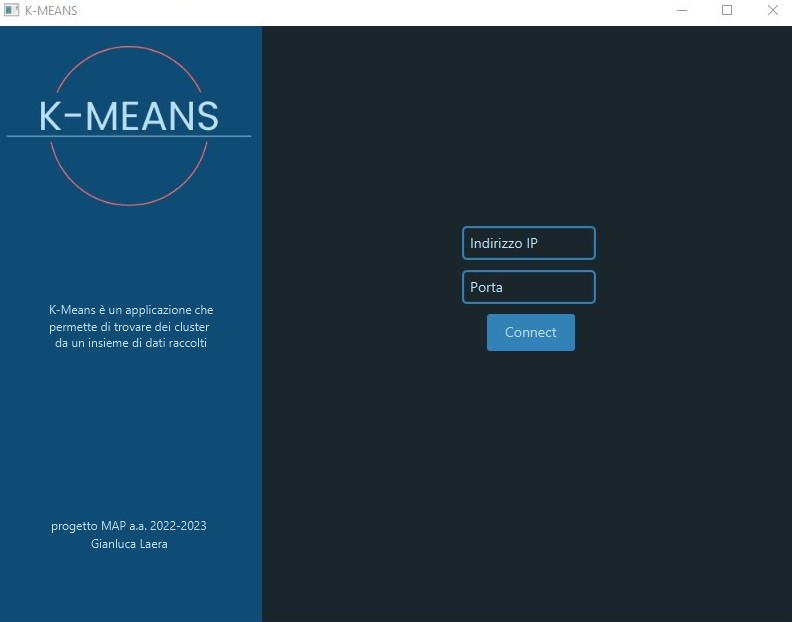

A questo punto si aprirà una nuova schermata con 2 pulsanti sulla sinistra che permettono di eseguire le diverse operazioni:

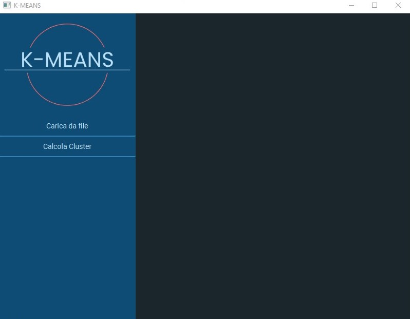

Il bottone Caricare da file permette di caricare i cluster da un file che verranno poi mostrati a schermo:

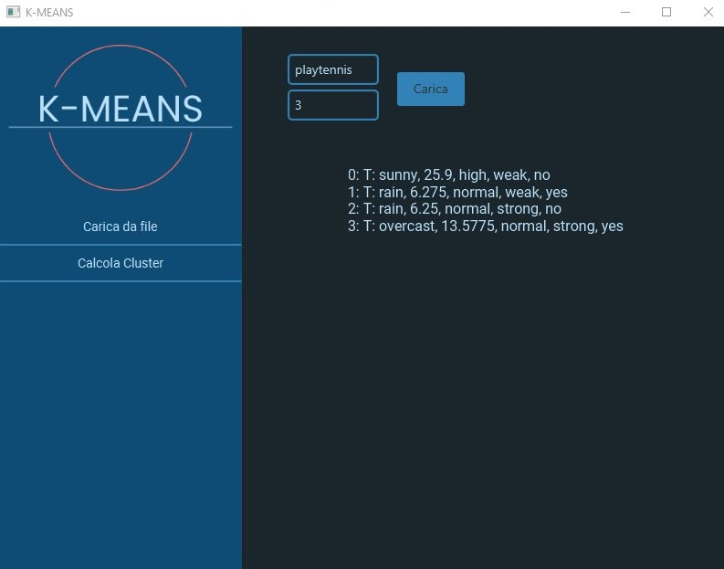

Il bottone Calcola cluster, invece, permette di calcolare i cluster su una taballe recuperata dal database, e quindi mostra a schermo la tabella e i cluster trovati:

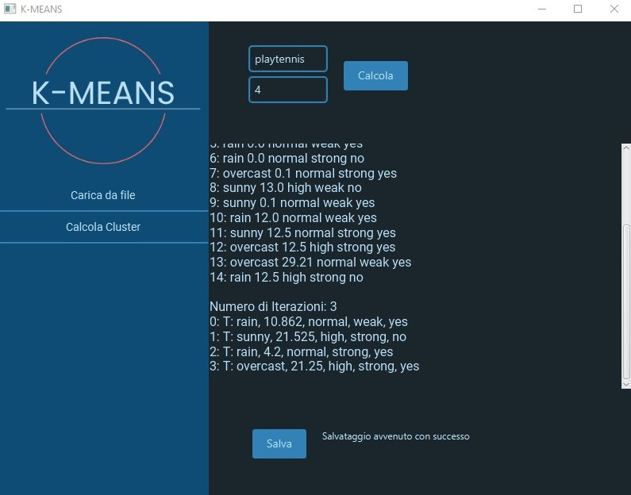

I cluster trovati poi possono essere salvati tramite il pulsante salva, in un file che sarà automaticamente nominato `nomeTabella_iterazioni.bin`.

### Schermate di errore:
Seguono delle foto di alcune possibili schermate d'errore che possono verificarsi:

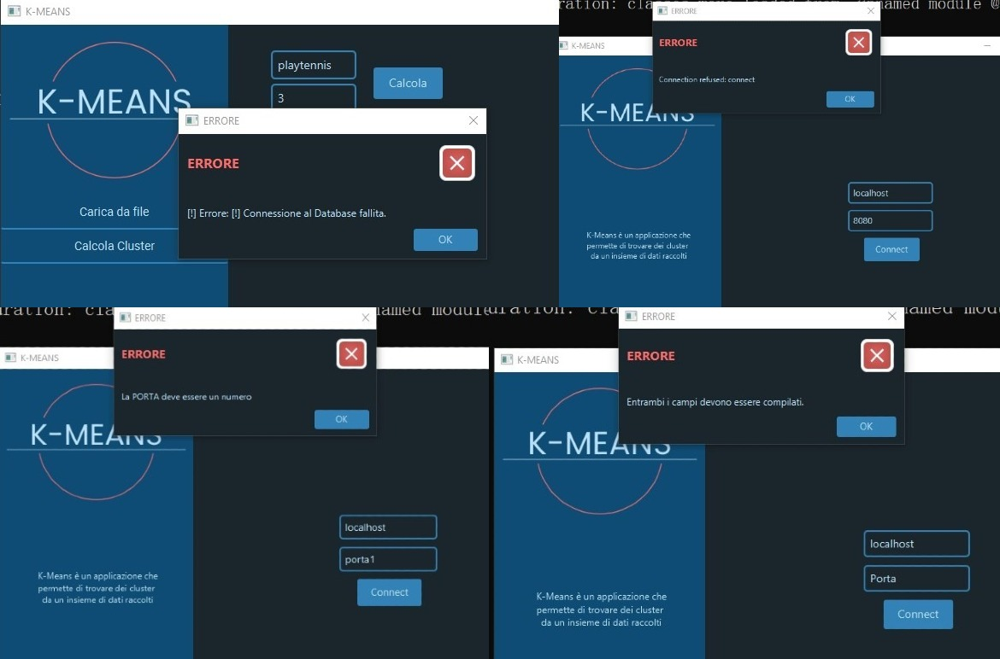

## Diagramma UML delle classi
Di seguito vengono presentati i diagrammi UML delle classi del Server suddivisi per Package:
### Package: data

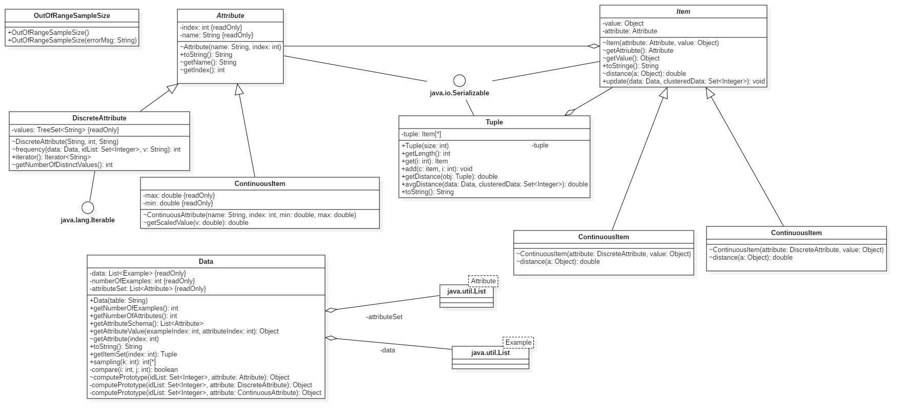 (server)

### Package: database (server)

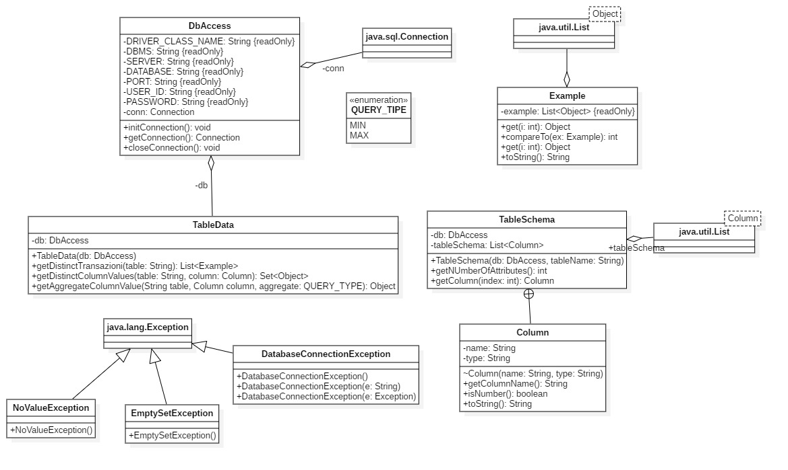

### Package: mining (server)

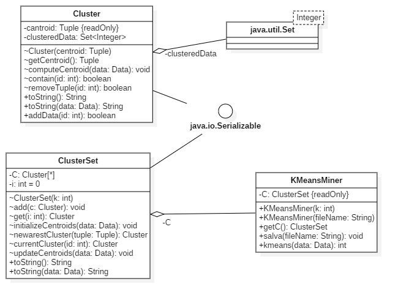

### Package: default (server)

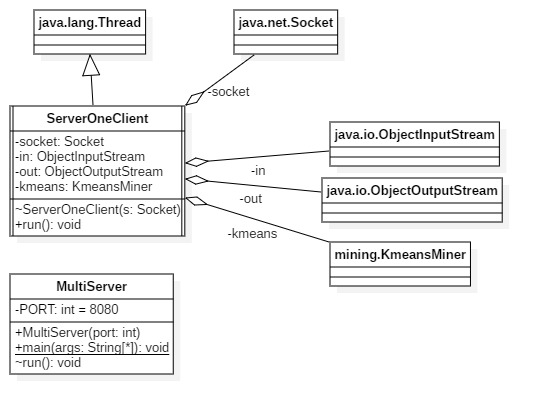

### Package: default (client)

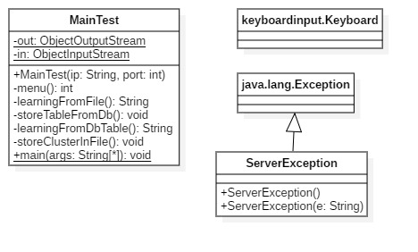

## Diagramma UML delle classi (estensione)

Ecco invece il diagramma UML del client che implementa l'interfaccia grafica:

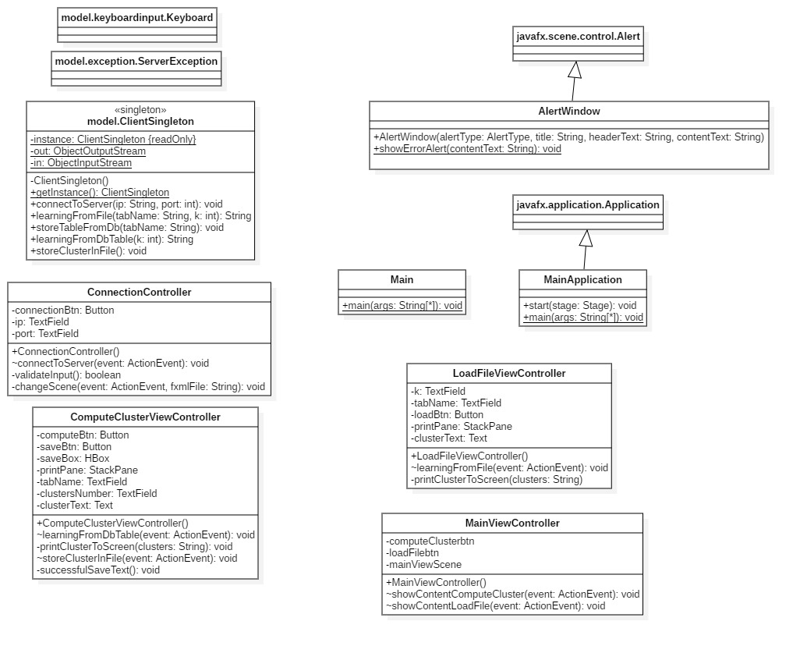

